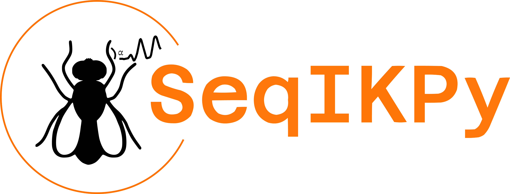

<div align="center">


<p align="center">

</p>


[](https://opensource.org/license/apache-2-0)

</div>


# 🪰 Overview

`SeqIKPy` is a Python package that provides an implementation of inverse kinematics (IK) that is based on the open-source Python package [IKPy](https://github.com/Phylliade/ikpy). In constrast to the current IK approaches that aims to match only the end-effector, `SeqIKPy` is designed to calculate the joint angles of the fly body parts to align the 3D pose of the entire kinematic chain to a desired 3D pose.

# 📐 Features

* **Pose alignment:** Align of 3D pose data to a fly biomechanical model, e.g., [NeuroMechFly](https://github.com/NeLy-EPFL/NeuroMechFly).
* **Leg inverse kinematics:** Calculate leg joint angles using sequential inverse kinematics.
* **Head inverse kinematics:** Calculate head and antenna joint angles using the vector dot product method.
* **Visualization and animation:** Visualize and animate the results in 3D.

<!-- # Summary of directories

```
.
├── data: Folder containing the sample data.
├── docs: Documentation for the website.
├── examples: Examples and tutorials on how to use the package.
├── seqikpy: Main package.
└── tests: Tests for the package.
``` -->


# 📚 Documentation

Documentation can be found [here](https://nely-epfl.github.io/sequential-inverse-kinematics/).

# 🛠️ Installation

You can pip install the package by running the following line in the terminal:
```bash
$ pip install seqikpy
```

Or, you can install the newest version of the package manually by running the following line in the terminal:
```bash
$ pip install https://github.com/NeLy-EPFL/sequential-inverse-kinematics.git
```

Note that the IKPy module is added as a submodule. To initialize the submodule, run:
```bash
$ git submodule add https://github.com/gizemozd/ikpy.git ikpy_submodule
$ git submodule update --init
```

# 🏁 Quick Start


# 💻 Contributing

We welcome contributions from the community. If you would like to contribute to the project, please refer to the [contribution guidelines](). Also, read our [code of conduct](). If you have any questions, please feel free to open an issue or contact the developers.

# 📖 License

This project is licensed under the [Apache 2.0 License]().

# 🐞 Issues
If you encounter any bugs or request a new feature, please open an issue in our [issues page]().

# 💬 Citing
If you find this package useful in your research, please consider citing it using the following BibTeX entry:

```bibtex
```